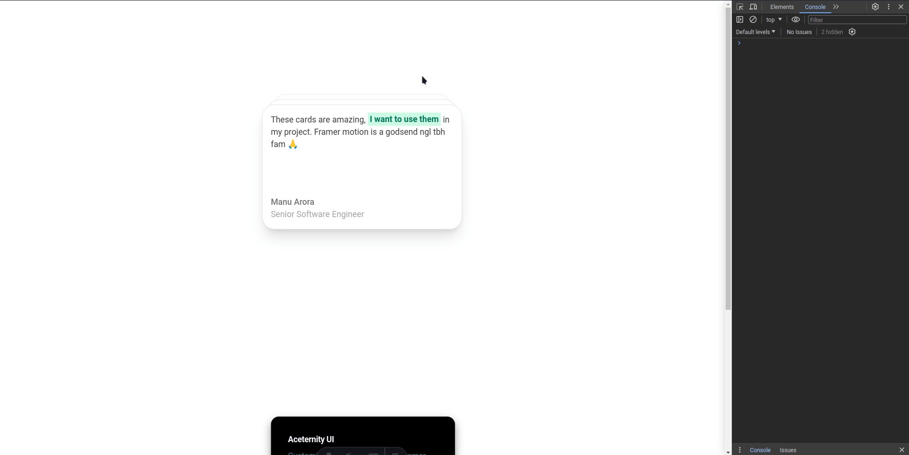

# Astro X Aceternity UI

[Astro](https://astro.build/) X [Aceternity UI](https://ui.aceternity.com/)

# Demo



# Set up

1. Set up basic Astro project

```bash
pnpm create astro@latest
```

2. Add Tailwind CSS

```bash
pnpx astro add tailwind 
```

3. Add React

```bash
pnpx astro add react
```

4. Install Aceternity UI additional dependencies

- [Official guide](https://ui.aceternity.com/docs/add-utilities)

```bash
pnpm i framer-motion clsx tailwind-merge
```

5. Set up cn

`utils/cn.ts`
```typescript
import { ClassValue, clsx } from "clsx";
import { twMerge } from "tailwind-merge";

export function cn(...inputs: ClassValue[]) {
  return twMerge(clsx(inputs));
}
```

6. Update `tailwind.config.ts`

```diff
+ const {
+   default: flattenColorPalette,
+ } = require("tailwindcss/lib/util/flattenColorPalette");

/** @type {import('tailwindcss').Config} */
module.exports = {
  content: [
    "./src/pages/**/*.{js,ts,jsx,tsx,mdx}",
    "./src/components/**/*.{js,ts,jsx,tsx,mdx}",
    "./src/app/**/*.{js,ts,jsx,tsx,mdx}",

    // Or if using `src` directory:
    "./src/**/*.{js,ts,jsx,tsx,mdx}",
  ],
+  darkMode: "class",
  theme: {
    extend: {},
  },
+  plugins: [addVariablesForColors],
};

+ // This plugin adds each Tailwind color as a global CSS variable, e.g. var(--gray-200).
+ function addVariablesForColors({ addBase, theme }: any) {
+  let allColors = flattenColorPalette(theme("colors"));
+  let newVars = Object.fromEntries(
+    Object.entries(allColors).map(([key, val]) => [`--${key}`, val])
+  );
+
+  addBase({
+    ":root": newVars,
+ });
}

```

7. Optional: Path aliases

`tsconfig.json`

```diff
{
  "extends": "astro/tsconfigs/strict",
  "compilerOptions": {
    "jsx": "react-jsx",
    "jsxImportSource": "react",
+    "baseUrl": ".",
+    "paths": {
+      "@/*": ["src/*"],
+      "@components/*": ["src/components/*"],
+      "@aceternityui/*": ["src/components/react/aceternityui/*"]
    }
  }
}
```

# My approach

> We'll use the [Card Stack component](https://ui.aceternity.com/components/card-stack) as an example

1. Component source
2. React implementation
3. Astro component wrapper
4. Use Aceternity UI component

## 1. Component source

`src/components/react/aceternityui/CardStack.tsx`

<details>
  <summary>
    Card Stack source code
  </summary>

  ```jsx
  // "use client"; <- Can be omitted, this is React not Next.js
  import { useEffect, useState } from "react";
  import { motion } from "framer-motion";

  let interval: any;

  type Card = {
    id: number;
    name: string;
    designation: string;
    content: React.ReactNode;
  };

  export const CardStack = ({
    items,
    offset,
    scaleFactor,
  }: {
    items: Card[];
    offset?: number;
    scaleFactor?: number;
  }) => {
    const CARD_OFFSET = offset || 10;
    const SCALE_FACTOR = scaleFactor || 0.06;
    const [cards, setCards] = useState<Card[]>(items);

    useEffect(() => {
      startFlipping();
    }, []);
    const startFlipping = () => {
      interval = setInterval(() => {
        setCards((prevCards: Card[]) => {
          const newArray = [...prevCards]; // create a copy of the array
          newArray.unshift(newArray.pop()!); // move the last element to the front
          return newArray;
        });
      }, 5000);

      return () => clearInterval(interval);
    };

    return (
      <div className="relative  h-60 w-60 md:h-60 md:w-96">
        {cards.map((card, index) => {
          return (
            <motion.div
              key={card.id}
              className="absolute dark:bg-black bg-white h-60 w-60 md:h-60 md:w-96 rounded-3xl p-4 shadow-xl border border-neutral-200 dark:border-white/[0.1]  shadow-black/[0.1] dark:shadow-white/[0.05] flex flex-col justify-between"
              style={{
                transformOrigin: "top center",
              }}
              animate={{
                top: index * -CARD_OFFSET,
                scale: 1 - index * SCALE_FACTOR, // decrease scale for cards that are behind
                zIndex: cards.length - index, //  decrease z-index for the cards that are behind
              }}
            >
              <div className="font-normal text-neutral-700 dark:text-neutral-200">
                {card.content}
              </div>
              <div>
                <p className="text-neutral-500 font-medium dark:text-white">
                  {card.name}
                </p>
                <p className="text-neutral-400 font-normal dark:text-neutral-200">
                  {card.designation}
                </p>
              </div>
            </motion.div>
          );
        })}
      </div>
    );
  };
```
</details>

## 2. React implementation

<details>
  <summary>
    Card Stack source code <strong>in use</strong>
  </summary>

  ```jsx
  // "use client"; <- Can be omitted, this is React not Next.js
  import { CardStack } from "../ui/card-stack";
  import { cn } from "@/utils/cn";
  export function CardStackDemo() {
    return (
      <div className="h-[40rem] flex items-center justify-center w-full">
        <CardStack items={CARDS} />
      </div>
    );
  }

  // Small utility to highlight the content of specific section of a testimonial content
  export const Highlight = ({
    children,
    className,
  }: {
    children: React.ReactNode;
    className?: string;
  }) => {
    return (
      <span
        className={cn(
          "font-bold bg-emerald-100 text-emerald-700 dark:bg-emerald-700/[0.2] dark:text-emerald-500 px-1 py-0.5",
          className
        )}
      >
        {children}
      </span>
    );
  };

  const CARDS = [
    {
      id: 0,
      name: "Manu Arora",
      designation: "Senior Software Engineer",
      content: (
        <p>
          These cards are amazing, <Highlight>I want to use them</Highlight> in my
          project. Framer motion is a godsend ngl tbh fam 🙏
        </p>
      ),
    },
    {
      id: 1,
      name: "Elon Musk",
      designation: "Senior Shitposter",
      content: (
        <p>
          I dont like this Twitter thing,{" "}
          <Highlight>deleting it right away</Highlight> because yolo. Instead, I
          would like to call it <Highlight>X.com</Highlight> so that it can easily
          be confused with adult sites.
        </p>
      ),
    },
    {
      id: 2,
      name: "Tyler Durden",
      designation: "Manager Project Mayhem",
      content: (
        <p>
          The first rule of
          <Highlight>Fight Club</Highlight> is that you do not talk about fight
          club. The second rule of
          <Highlight>Fight club</Highlight> is that you DO NOT TALK about fight
          club.
        </p>
      ),
    },
  ];
```
</details>

## 3. Wrap React component with an Astro component and expose it

```astro
---
import { CardStackDemo } from '@components/react/CardStack'
---

<CardStackDemo client:only />
```

## 4. Use <span style="font-style: italic;" title="Yes. I coined this term today 🙂">"Astro-fied"</span> Aceternity UI component

`src/pages/index.astro`

```astro
---
import CardStack from '@components/CardStack.astro'
---

<html lang="en">
	<head>
		<meta charset="utf-8" />
		<link rel="icon" type="image/svg+xml" href="/favicon.svg" />
		<meta name="viewport" content="width=device-width" />
		<meta name="generator" content={Astro.generator} />
		<title>Astro</title>
	</head>
	<body>
		<CardStack />
	</body>
</html>

```

# Reference

- [Using React components in Astro page/component](https://docs.astro.build/en/guides/framework-components/#using-framework-components)